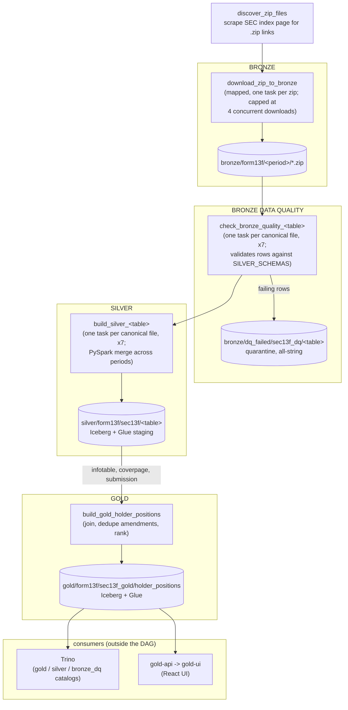

# SEC Form 13F → Bronze/Silver (Iceberg) Pipeline

Medallion-architecture ingestion of the SEC's [Form 13F structured data sets](https://www.sec.gov/data-research/sec-markets-data/form-13f-data-sets),
orchestrated by Apache Airflow. Silver output is Apache Iceberg tables; an additional bronze-layer
data-quality stage validates against silver's schema and quarantines invalid records for review.
Gold is one curated fact table, `holder_positions`, answering "who are the largest holders of a
given security for a specified quarter?"

## Architecture

```
                 ┌────────────────────┐
                 │   Airflow DAG       │
                 │  sec_13f_pipeline   │
                 └─────────┬──────────┘
                            │
      1. discover_zip_files │  scrape SEC index page for .zip links
                            ▼
BRONZE
      2. download_zip_to_bronze (mapped, one task per zip)
            │  download zip, upload it byte-for-byte, no parsing
            ▼  s3://sec-13f-lake/bronze/form13f/<period>/<original_filename>.zip
                            │
BRONZE DATA QUALITY
      3. check_bronze_quality_<table> (one explicitly-named task per canonical flat-file name)
            │  re-extract that file from every bronze zip, validate every
            │  row against SILVER_SCHEMAS (try_cast per non-string column),
            │  quarantine only the rows that fail — untouched, all-string
            ▼  s3://sec-13f-lake/bronze/dq_failed/sec13f_dq/<table>/{data,metadata}/...
                            │
SILVER
      4. build_silver_<table> (one explicitly-named task per canonical flat-file name)
            │  extract that file from every bronze zip to local staging
            │  (Python), then merge across periods with a local PySpark
            │  session and write the result as an Apache Iceberg table
            │  directly to S3; register a Glue table pointing at it
            ▼  s3://sec-13f-lake/silver/form13f/sec13f/<table>/{data,metadata}/...
                            │
GOLD
      5. build_gold_holder_positions
            │  join silver's infotable + coverpage + submission, resolve the
            │  true reporting quarter, deduplicate amendments, aggregate and
            │  rank positions per (holder, quarter, security)
            ▼  s3://sec-13f-lake/gold/form13f/sec13f_gold/holder_positions/{data,metadata}/...
                          done
```

Same flow, as Mermaid:



| Stage | Component | Notes |
|---|---|---|
| Orchestration | Apache Airflow (LocalExecutor) | `dags/sec_13f_pipeline.py` |
| Discovery | Airflow task, `requests` + `BeautifulSoup` | Scrapes the SEC index page for `.zip` links (legacy quarterly and post-2024 rolling-window filenames alike) |
| Bronze | Airflow dynamic-mapped task | One mapped instance per zip; uploads the zip **as-is** to S3, no extraction. Capped at 4 concurrent downloads (`max_active_tis_per_dagrun`) — found necessary by running it: ~54 simultaneous SEC.gov downloads broke connections mid-transfer, see IMPLEMENTATION.md |
| Bronze data quality | One task per canonical file, statically named, between bronze and silver | `check_bronze_quality_submission`, `check_bronze_quality_infotable`, etc.; re-extracts its file from every bronze zip and validates each row against the explicit `SILVER_SCHEMAS` type contract, quarantining only the rows that fail into a mirrored, all-string Iceberg table for review — see "Bronze data-quality quarantine tables" below |
| Silver | One task per canonical file, statically named | `build_silver_submission`, `build_silver_infotable`, etc. (`CANONICAL_FILES` in the DAG); each extracts its file from every bronze zip, merges across periods with a local PySpark session, writes the result as an **Apache Iceberg table** (Parquet data + Avro/JSON Iceberg metadata) directly to S3, and registers it as a Glue staging table |
| Gold | Single task, downstream of `build_silver_{infotable,coverpage,submission}` | `build_gold_holder_positions`; reads three silver tables (not bronze), resolves the true reporting quarter, deduplicates 13F amendments, aggregates duplicate position lines, and ranks — see "Gold table: holder_positions" below |
| Gold UI | `gold-api` + `gold-ui` services (not part of the DAG) | A small read-only React app for browsing `holder_positions` without writing SQL — see "Gold UI" below |

## Silver table schemas

Column types are **inferred** by Spark from the actual data (see "Schema inference, and why a few
columns are forced back to string" in [IMPLEMENTATION.md](IMPLEMENTATION.md)) — not hardcoded, and
not uniformly `string` the way earlier versions of this pipeline were. Every table also carries
`filing_period` (`string`), the Iceberg partition column the pipeline adds itself (`<YYYY>q<N>` pre-2024,
`<DDmonYYYY>-<DDmonYYYY>` since the mid-2024 rolling-window change) — it isn't an SEC field, so
it's omitted from the per-table column lists below. Column names, presence, and types were pulled
directly off the actual running tables (`df.dtypes` on each `silver.sec13f.<table>`), not
transcribed from SEC's documentation or assumed, so this reflects what the pipeline really
produces.

### `submission` — one row per 13F filing

| Column | Type | Description |
|---|---|---|
| `accession_number` | string | SEC accession number identifying the filing (primary key across all silver tables) |
| `filing_date` | string | Date the filing was submitted to EDGAR (SEC's `DD-MON-YYYY` format, not auto-parsed as a date — see IMPLEMENTATION.md) |
| `submissiontype` | string | Form variant, e.g. `13F-HR`, `13F-NT`, or an amendment variant |
| `cik` | string | Filer's SEC Central Index Key — zero-padded (e.g. `0000823621`); forced to string, see IMPLEMENTATION.md |
| `periodofreport` | string | Quarter-end date the filing reports holdings as of |

### `coverpage` — one row per filing, cover-page metadata

| Column | Type | Description |
|---|---|---|
| `accession_number` | string | Filing this cover page belongs to |
| `reportcalendarorquarter` | string | Calendar quarter-end date being reported |
| `isamendment` | string | Y/N — whether this filing is an amendment |
| `amendmentno` | int | Amendment number, if applicable |
| `amendmenttype` | string | Amendment type — restatement vs. new-holdings amendment |
| `confdeniedexpired` | string | Status of a confidential-treatment request, if one was made |
| `datedeniedexpired` | string | Date that confidential-treatment status changed |
| `datereported` | string | Date associated with the confidentiality determination |
| `reasonfornonconfidentiality` | string | Why previously-confidential info is no longer confidential |
| `filingmanager_name` | string | Filing manager's registered name |
| `filingmanager_street1` / `filingmanager_street2` | string | Filing manager's registered street address |
| `filingmanager_city` | string | Filing manager's registered city |
| `filingmanager_stateorcountry` | string | Filing manager's registered state/country |
| `filingmanager_zipcode` | string | Filing manager's registered ZIP code — some values are hyphenated (`100-210`), which is exactly why full-column inference (not a sample) matters, see IMPLEMENTATION.md |
| `reporttype` | string | e.g. `13F COMBINATION REPORT`, `13F HOLDINGS REPORT` |
| `form13ffilenumber` | string | Manager's 13F file number (e.g. `028-15535`); forced to string, see IMPLEMENTATION.md |
| `crdnumber` | string | Manager's CRD number, if registered as a broker-dealer/investment adviser — zero-padded (e.g. `000307644`); forced to string, see IMPLEMENTATION.md |
| `secfilenumber` | string | Manager's SEC file number (e.g. `801-131761`); forced to string, see IMPLEMENTATION.md |
| `provideinfoforinstruction5` | string | Response flag tied to Form 13F Instruction 5 |
| `additionalinformation` | string | Free-text additional information |

### `othermanager` — other managers reporting on this same filing (cover-page level)

| Column | Type | Description |
|---|---|---|
| `accession_number` | string | Filing this row belongs to |
| `othermanager_sk` | int | Surrogate key for this other-manager row |
| `cik` | string | Other manager's CIK — zero-padded; forced to string, see IMPLEMENTATION.md |
| `form13ffilenumber` / `crdnumber` / `secfilenumber` | string | Other manager's filing identifiers; forced to string, see IMPLEMENTATION.md |
| `name` | string | Other manager's name |

### `othermanager2` — other managers, referenced from individual holdings

| Column | Type | Description |
|---|---|---|
| `accession_number` | string | Filing this row belongs to |
| `sequencenumber` | int | Index that `infotable.othermanager` refers back to |
| `cik` | string | Other manager's CIK — zero-padded; forced to string, see IMPLEMENTATION.md |
| `form13ffilenumber` / `crdnumber` / `secfilenumber` | string | Other manager's filing identifiers; forced to string, see IMPLEMENTATION.md |
| `name` | string | Other manager's name |

### `signature` — filing signature block

| Column | Type | Description |
|---|---|---|
| `accession_number` | string | Filing this signature belongs to |
| `name` | string | Signatory's name |
| `title` | string | Signatory's title |
| `phone` | string | Signatory's phone number |
| `signature` | string | Signature text |
| `city` / `stateorcountry` | string | Where the filing was signed |
| `signaturedate` | string | Date signed |

### `summarypage` — filing-level holdings summary

| Column | Type | Description |
|---|---|---|
| `accession_number` | string | Filing this summary belongs to |
| `otherincludedmanagerscount` | int | Count of other managers included in this filing |
| `tableentrytotal` | int | Total number of holdings rows (`infotable` entries) in the filing |
| `tablevaluetotal` | bigint | Total reported market value across all holdings in the filing |
| `isconfidentialomitted` | string | Y/N — whether any holdings were omitted as confidential |

### `infotable` — one row per reported holding (the actual positions; by far the largest table)

| Column | Type | Description |
|---|---|---|
| `accession_number` | string | Filing this holding belongs to |
| `infotable_sk` | int | Surrogate key for this holding row |
| `nameofissuer` | string | Issuer name of the security held |
| `titleofclass` | string | Class/type of the security (e.g. `COM`, `CL A`) |
| `cusip` | string | CUSIP identifier of the security (alphanumeric, e.g. `00206R102` — naturally not numeric) |
| `figi` | string | FIGI identifier of the security (blank in older filings — added to the format later) |
| `value` | bigint | Reported market value of the position (thousands of USD, per SEC's own convention) |
| `sshprnamt` | bigint | Number of shares or principal amount held |
| `sshprnamttype` | string | Whether `sshprnamt` is `SH` (shares) or `PRN` (principal amount) |
| `putcall` | string | `PUT`/`CALL` if this position is an option, blank otherwise |
| `investmentdiscretion` | string | `SOLE`, `DFND`, or `OTR` — degree of investment discretion |
| `othermanager` | string | References `othermanager2.sequencenumber` for managers sharing discretion |
| `voting_auth_sole` | bigint | Shares over which the manager has sole voting authority |
| `voting_auth_shared` | bigint | Shares over which voting authority is shared |
| `voting_auth_none` | bigint | Shares over which the manager has no voting authority |

`value`, `sshprnamt`, and the `voting_auth_*` columns are `int` rather than `bigint` when inferred
from a small subset of periods (e.g. two quarters) — they only widen to `bigint` once enough of the
13-year history is present that some value exceeds the 32-bit range. This is a real, observed
consequence of inferring across *all* staged periods in one pass (see IMPLEMENTATION.md): the
schema is only as wide as the data that's actually there.

## Gold table: `holder_positions`

Answers "who are the largest holders of a given security for a specified quarter?" — one row per
(`cik`, `periodofreport`, `cusip`), ranked by position size. Built by `build_gold_holder_positions`
from silver's `infotable` + `coverpage` + `submission`, not from bronze. The full transformation
rationale (why `periodofreport` and not `filing_period`, the amendment-dedup rule, why duplicate
`infotable` lines get summed) is in that task's own docstring in `dags/sec_13f_pipeline.py` and in
IMPLEMENTATION.md; this is just the resulting schema.

| Column | Type | Description |
|---|---|---|
| `cik` | string | Holder's SEC Central Index Key (the stable grouping key — `filingmanager_name` drifts in spelling across quarters, confirmed against real data: `APPLE INC` / `Apple Inc` / `Apple Inc.` all appear for the same CUSIP) |
| `periodofreport` | date | The quarter-end date holdings are reported as of — parsed from `submission.periodofreport`, not the pipeline's own `filing_period` |
| `cusip` | string | The security being held |
| `total_value` | bigint | Summed reported market value across every `infotable` line for this holder+security+quarter (thousands of USD, SEC's own convention) — the ranking basis |
| `total_shares` | bigint | Summed share count, `sshprnamttype='SH'` lines only (share counts and bond principal amounts aren't a comparable unit) |
| `nameofissuer` | string | Issuer name, taken from one of the underlying `infotable` rows (display only — `cusip` is the actual key) |
| `titleofclass` | string | Security class/type, same caveat as `nameofissuer` |
| `filingmanager_name` | string | Holder's display name (from `coverpage`) |
| `lot_count` | bigint | How many raw `infotable` rows were summed into this one — a real filing was found with 138 separate lines for a single CUSIP |
| `source_accession_numbers` | string | Comma-joined accession number(s) this row's data came from, after amendment resolution — traceability back to the exact filing(s) |
| `rank` | int | `RANK() OVER (PARTITION BY cusip, periodofreport ORDER BY total_value DESC)` — ties share a rank |
| `total_value_pct_change` | double | % change in `total_value` vs. this same (`cik`, `cusip`)'s previous row, ordered by `periodofreport` — the previous period *they reported this cusip*, not necessarily the prior calendar quarter. Null for that pair's first period, and when the prior period's value was 0 |
| `total_shares_pct_change` | double | Same, for `total_shares`. Null-on-zero-prior matters more here: `total_shares` is legitimately 0 for bond-only (non-SH) positions |

Partitioned by `periodofreport`. Registered in Glue database `sec13f_gold` (own Iceberg catalog
namespace `sec13f_gold`, S3 prefix `gold/form13f`) — separate from silver's catalog/database, same
reasoning as the bronze data-quality tables.

Verified against the real, full 54-period history (79,657,796 rows): the CIK/quarter pair found
earlier with a real RESTATEMENT amendment (`0001399794`, `2015-12-31`) has every row's
`source_accession_numbers` pointing at only the restatement, never the superseded original;
ranking is confirmed monotonically decreasing by `total_value` within a `(cusip, periodofreport)`;
and there are zero duplicate `(cik, periodofreport, cusip)` groups.

## Bronze data-quality quarantine tables

`check_bronze_quality_<table>` (see Architecture above) writes one Iceberg table per canonical
file to `bronze_dq.sec13f_dq.<table>` (S3: `bronze/dq_failed/sec13f_dq/<table>/`, Glue database
`sec13f_dq_failed`) — deliberately separate from silver's own catalog/namespace/Glue database, so
quarantined data never shows up mixed in with the real tables. Every quarantine table has:

- **The same columns as the corresponding silver table** (see above), so a reviewer can compare
  a quarantined row directly against what a clean row would look like.
- **Every column typed `string`**, including ones that are `int`/`bigint` in silver — a row is
  quarantined *because* one of its values didn't fit its expected type, so the table that holds it
  can't require that type either. Values are otherwise completely unmodified: whatever raw text
  came out of the bronze zip is exactly what's in the quarantine table.
- **`filing_period`**, same as silver.
- **`dq_failed_columns`**: a comma-separated list of which column(s) on that row failed validation
  (e.g. `amendmentno` for a row where that field contained non-numeric text) — this is what makes
  the table actually useful for remediation, not just a copy of bad rows with no indication of what
  to fix.

A table with zero failing rows still gets created (as an empty Iceberg table) every run, so its
absence never has to be interpreted — "no data" and "not checked yet" are different things. See
IMPLEMENTATION.md for why this validates via `try_cast` against an explicit schema instead of
reusing silver's own (inferred, not fixed) schema, and why it doesn't block silver even though it
runs before it in the DAG.

## Local stack vs. production AWS

| Production | Local substitute |
|---|---|
| S3 bucket | [LocalStack](https://www.localstack.cloud/) S3 (`localstack` service, port 4566) — Community edition, free |
| AWS Glue Data Catalog | [moto](https://github.com/getmoto/moto)'s `mock_aws()`, used directly inside the silver task |
| Managed Airflow (e.g. MWAA) | Airflow webserver + scheduler containers, Postgres metadata DB |

LocalStack is bootstrapped on startup via `localstack/init-aws.sh` (an init hook), which creates
the `sec-13f-lake` S3 bucket before the DAG ever runs.

See [IMPLEMENTATION.md](IMPLEMENTATION.md) for why each of these was chosen the way it was
(including two rejected approaches for the Iceberg catalog), Spark/heap sizing details, and the
rest of the implementation notes and real bugs found by running this against live data.

## Querying with Trino

A `trino` service (`trinodb/trino:483`) is included for ad hoc SQL against the data — the actual
point of the gold layer, since nothing else in this stack lets you just run a `SELECT`. It's
configured with three catalogs, one per Iceberg catalog the pipeline itself writes to, each using
Trino's Iceberg connector in `iceberg.catalog.type=jdbc` mode pointed at the same Postgres
JdbcCatalog and the same LocalStack S3 endpoint the DAG uses — no separate metastore, no copying
data, Trino reads exactly what Spark wrote:

| Trino catalog | Matches DAG's Iceberg catalog | Schema |
|---|---|---|
| `gold` | `gold` | `sec13f_gold` |
| `silver` | `silver` | `sec13f` |
| `bronze_dq` | `bronze_dq` | `sec13f_dq` |

```bash
docker compose exec trino trino --server http://localhost:8080

trino> SELECT rank, filingmanager_name, total_value, total_shares
    -> FROM gold.sec13f_gold.holder_positions
    -> WHERE cusip = '037833100' AND periodofreport = DATE '2019-03-31'
    -> ORDER BY rank LIMIT 10;
```

Or non-interactively: `docker compose exec trino trino --server http://localhost:8080 --execute "..."`.
Web UI at `http://localhost:8081` (Trino's own default port, 8080, is remapped on the host side —
`airflow-webserver` already occupies 8080).

## Gold UI

A lightweight React app for browsing `holder_positions` without writing SQL — pick a reporting
quarter, search a security by name or CUSIP, see its top holders (bar chart + table, including the
`total_value_pct_change`/`total_shares_pct_change` columns), then click a holder to see their
position in that security over time (line chart). Two services, both new, neither part of the DAG:

| Service | What it is | Port |
|---|---|---|
| `gold-api` | FastAPI (`ui/api/main.py`), read-only, queries Trino's `gold` catalog | `8000` |
| `gold-ui` | React + Vite (`ui/web/`), calls `gold-api` from the browser | `3000` |

`gold-api` is the only new thing talking to Trino — it never touches S3, Postgres/JdbcCatalog, or
Glue directly, same separation of concerns as a human running `trino` CLI queries. Every value
that reaches a SQL string is validated first (an ISO date, digits, or an alphanumeric CUSIP) or
quote-escaped (free-text search), rather than passed through the Trino client's own parameter
binding — see `ui/api/main.py`'s module docstring for why.

`gold-ui` is a production build served by `vite preview` inside its container (simplest thing that
serves static files correctly; no nginx layer for a single-page local dev tool). It's built with a
baked-in `VITE_API_BASE_URL=http://localhost:8000` (`ui/web/.env`, checked in — not a secret, just
the host-published port the *browser* needs, which is not the same as the `gold-api` service name
the browser can't resolve). If you remap `gold-api`'s host port, rebuild `gold-ui` with a matching
`VITE_API_BASE_URL`.

Until `build_gold_holder_positions` has run at least once, `gold-api`'s `/api/periods` returns an
empty list and the UI says so rather than erroring — the gold table not existing yet is an expected
state, not a bug.

## Running it

```bash
docker compose build
docker compose up airflow-init      # one-time: migrate DB, create admin user
docker compose up -d

# Airflow UI:  http://localhost:8080  (admin/admin)
# Trino UI:    http://localhost:8081
# LocalStack:  http://localhost:4566
# Gold UI:     http://localhost:3000  (needs build_gold_holder_positions to have run at least once)
# Gold API:    http://localhost:8000
```

Trigger `sec_13f_pipeline` from the Airflow UI (or
`docker compose exec airflow-scheduler airflow dags trigger sec_13f_pipeline`).

Inspect the bronze data (plain zips) directly against LocalStack:

```bash
export AWS_ACCESS_KEY_ID=test AWS_SECRET_ACCESS_KEY=test AWS_DEFAULT_REGION=us-east-1
aws --endpoint-url http://localhost:4566 s3 ls s3://sec-13f-lake/bronze/form13f/ --recursive
```

Silver is an Iceberg table, so listing S3 keys only shows raw Parquet/Avro/JSON file names, not
anything queryable — read it with a Spark session pointed at the same `JdbcCatalog` the DAG uses
(see `dags/sec_13f_pipeline.py` for the exact catalog config: same Postgres, same S3FileIO/
LocalStack settings), e.g. `spark.table("silver.sec13f.infotable")`, or the metadata tables
(`silver.sec13f.infotable.partitions`, `.snapshots`, `.history`).

The bronze data-quality quarantine tables are read the same way, against the `bronze_dq` catalog
instead of `silver` (same Postgres, same S3FileIO/LocalStack settings, different `warehouse`):
`spark.table("bronze_dq.sec13f_dq.infotable")`.

The gold table is read the same way too, against the `gold` catalog:
`spark.table("gold.sec13f_gold.holder_positions")`. E.g., the largest holders of Apple
(CUSIP `037833100`) for Q1 2019:

```python
(
    spark.table("gold.sec13f_gold.holder_positions")
    .filter("cusip = '037833100' AND periodofreport = '2019-03-31'")
    .orderBy("rank")
    .select("rank", "filingmanager_name", "total_value", "total_shares")
    .show(10, truncate=False)
)
```

(Glue can't be inspected this way — see IMPLEMENTATION.md's "Why Glue is mocked with moto instead
of LocalStack".)

## Repo layout

```
README.md                      # architecture, table schemas, how to run it
IMPLEMENTATION.md              # why things are built the way they are; implementation notes
docker-compose.yml
docker/airflow/Dockerfile      # Airflow image + Java (PySpark) + Iceberg/Postgres jars + Python deps (boto3, pyspark, moto)
dags/sec_13f_pipeline.py       # Airflow DAG: discover -> bronze download -> DQ check -> silver merge -> gold aggregate
localstack/init-aws.sh         # LocalStack bootstrap: create S3 bucket
requirements-airflow.txt
trino/node.properties           # Trino node identity
trino/jvm.config                # Trino JVM options
trino/config.properties         # Trino coordinator config (single-node)
trino/catalog/{gold,silver,bronze_dq}.properties  # one Trino catalog per Iceberg catalog the DAG writes
ui/api/main.py                  # gold-api: FastAPI, read-only, queries Trino's gold catalog
ui/web/                         # gold-ui: React + Vite app, top holders + position-history charts
```
